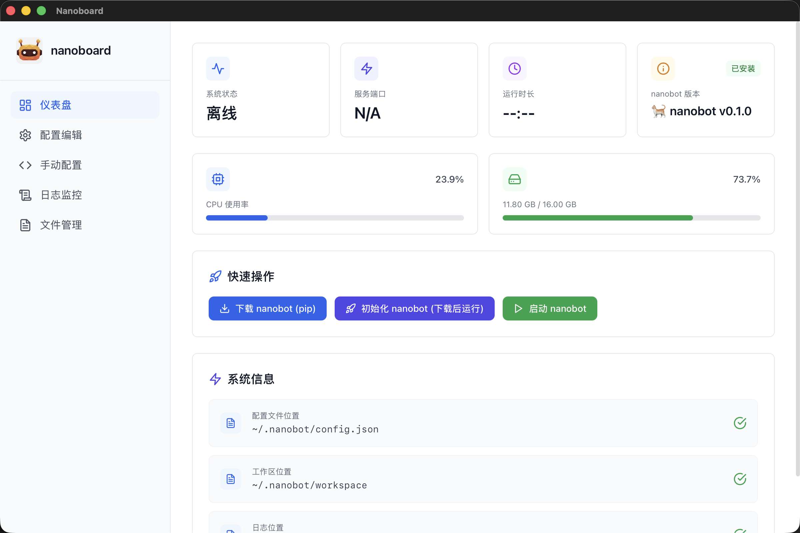
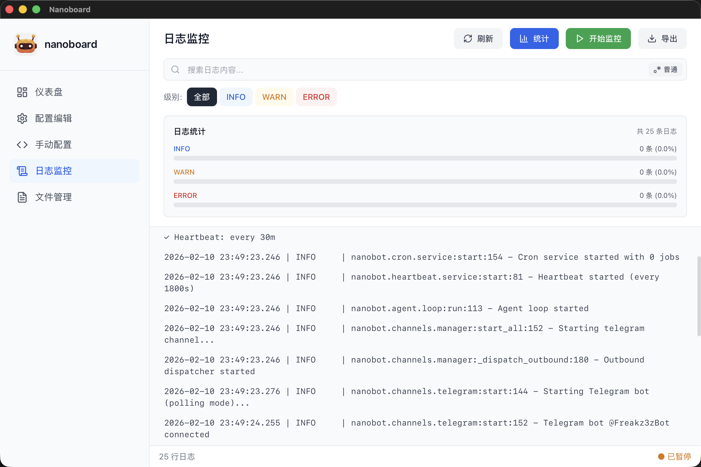
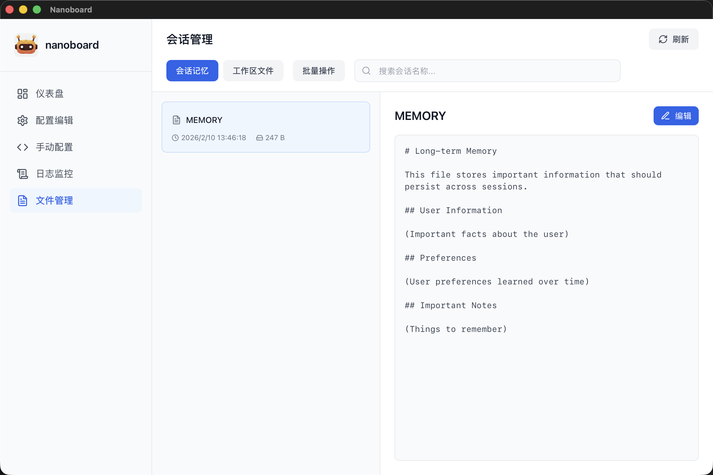

<div align="center">


**一个极轻量化的 nanobot 管理助手**

**An Ultra-lightweight nanobot Management Assistant**

[](https://www.rust-lang.org/)
[](https://react.dev/)
[](https://tauri.app/)
[](https://opensource.org/licenses/MIT)

</div>

---

## ✨ 特性

- **可视化仪表盘** - 实时监控 Nanobot 运行状态和系统资源
- **配置编辑** - 使用 Monaco Editor 可视化编辑配置文件
- **快速启动** - 一键启动/停止 Nanobot Gateway
- **日志监控** - 实时查看和过滤应用日志
- **文件管理** - 查看、编辑和管理工作区文件
- **轻量化** - 基于 Tauri 构建，性能优越且资源占用低

## 📸 演示

<div align="center">

<table>
  <tr>
    <td align="center">
      
      <br/>
      监控状态/资源/配置·快速操作
    </td>
    <td align="center">
      
      <br/>
      实时查看·过滤应用日志
    </td>
  </tr>
  <tr>
    <td align="center">
      
      <br/>
      查看会话·管理文件
    </td>
    <td align="center">
      
      <br/>
      可视化配置·快速编辑
    </td>
  </tr>
</table>

</div>

## 🚀 快速开始

在 Release 页面下载最新版本的安装包，支持 Windows、macOS 和 Linux。

## 🛠️ 技术栈

- **后端**: Rust + Tauri 2.0
- **前端**: React 18 + TypeScript
- **构建工具**: Vite
- **UI 框架**: TailwindCSS
- **图标**: Lucide React
- **编辑器**: Monaco Editor
- **状态管理**: React Hooks + Context API
- **路由**: React Router v6
- **文件监控**: notify (Rust)

## 📁 项目结构

```
nanoboard/
├── src/                    # React 前端源码
│   ├── components/         # 可复用组件
│   │   ├── Layout.tsx         # 主布局组件
│   │   ├── ConfirmDialog.tsx  # 确认对话框
│   │   ├── EmptyState.tsx     # 空状态提示
│   │   ├── Toast.tsx          # 消息提示
│   │   └── KeyboardShortcutsHelp.tsx  # 快捷键帮助
│   ├── pages/             # 页面组件
│   │   ├── Dashboard.tsx      # 仪表盘
│   │   ├── ConfigEditor.tsx   # 配置编辑器
│   │   ├── CodeEditor.tsx     # 代码编辑器
│   │   ├── Logs.tsx           # 日志监控
│   │   └── Sessions.tsx       # 会话管理
│   ├── lib/               # 工具函数
│   │   ├── tauri.ts           # Tauri API 封装
│   │   └── defaultConfig.ts   # 默认配置
│   ├── contexts/          # React Context
│   ├── hooks/             # 自定义 Hooks
│   ├── assets/            # 静态资源
│   ├── App.tsx            # 主应用组件
│   └── main.tsx           # 应用入口
├── src-tauri/             # Rust 后端
│   ├── src/
│   │   ├── main.rs            # 主入口
│   │   ├── config.rs          # 配置管理
│   │   ├── process.rs         # 进程控制
│   │   ├── logger.rs          # 日志读取与监控
│   │   └── session.rs         # 会话管理
│   ├── Cargo.toml             # Rust 依赖配置
│   └── tauri.conf.json        # Tauri 配置
├── public/                # 公共静态资源
├── package.json           # Node.js 依赖配置
├── vite.config.ts         # Vite 构建配置
├── tailwind.config.js     # TailwindCSS 配置
├── tsconfig.json          # TypeScript 配置
└── README.md              # 项目文档
```

## 🔧 配置

Nanoboard 会自动读取以下 Nanobot 配置：

- **配置文件**: `~/.nanobot/config.json`
- **日志文件**: `~/.nanobot/logs/nanobot.log`
- **工作区**: `~/.nanobot/workspace`
- **记忆目录**: `~/.nanobot/workspace/memory`
- **会话目录**: `~/.nanobot/workspace/sessions`

## 💼 开发指南

### 前置要求

1. **Rust** (1.70+)
   ```bash
   curl --proto '=https' --tlsv1.2 -sSf https://sh.rustup.rs | sh
   ```

2. **Node.js** (20+)
   ```bash
   # 使用 nvm 安装
   nvm install 20
   nvm use 20
   ```

3. **系统依赖**

   **macOS**:
   ```bash
   xcode-select --install
   ```

   **Ubuntu/Debian**:
   ```bash
   sudo apt update
   sudo apt install libwebkit2gtk-4.0-dev \
     build-essential \
     curl \
     wget \
     file \
     libxdo-dev \
     libssl-dev \
     libayatana-appindicator3-dev \
     librsvg2-dev
   ```

   **Windows**:
   - 安装 [Microsoft C++ Build Tools](https://visualstudio.microsoft.com/visual-cpp-build-tools/)
   - 安装 [WebView2](https://developer.microsoft.com/en-us/microsoft-edge/webview2/)

### 安装

1. 克隆仓库：
   ```bash
   git clone https://github.com/Freakz3z/nanoboard.git
   cd nanoboard
   ```

2. 安装依赖：
   ```bash
   npm install
   ```

3. 启动开发模式：
   ```bash
   npm run tauri:dev
   ```

## 🔨 构建

### 开发构建

```bash
npm run tauri:dev
```

### 生产构建

```bash
npm run tauri:build
```

构建产物位于 `src-tauri/target/release/bundle/`

## 🗺️ 开发路线图

- [x] 基础仪表盘功能
- [x] 配置文件编辑器
- [x] 日志实时监控
- [x] 会话和文件管理
- [ ] 配置验证和错误提示增强
- [ ] 支持暗色主题
- [ ] 多语言支持（i18n）
- [ ] 自动更新功能
- [ ] 性能监控图表

## 🤝 贡献

欢迎提交 Issue 和 Pull Request！

1. Fork 本仓库
2. 创建你的特性分支 (`git checkout -b feature/AmazingFeature`)
3. 提交更改 (`git commit -m 'Add some AmazingFeature'`)
4. 推送到分支 (`git push origin feature/AmazingFeature`)
5. 开启一个 Pull Request

### 开发规范

- 遵循 ESLint 和 Prettier 代码规范
- 提交前运行 `npm run build` 确保构建成功
- 为新功能添加适当的注释
- 更新相关文档

## 📄 许可证

本项目采用 MIT 许可证 - 详见 [LICENSE](LICENSE) 文件

## 👨‍💻 作者

**Freakz3z** - [GitHub](https://github.com/Freakz3z)

## 🙏 致谢

- [Nanobot](https://github.com/HKUDS/nanobot) - 超轻量级个人 AI 助手
- [Tauri](https://tauri.app/) - 跨平台桌面应用框架
- [React](https://react.dev/) - UI 框架
- [TailwindCSS](https://tailwindcss.com/) - CSS 框架
- [Lucide](https://lucide.dev/) - 图标库

---